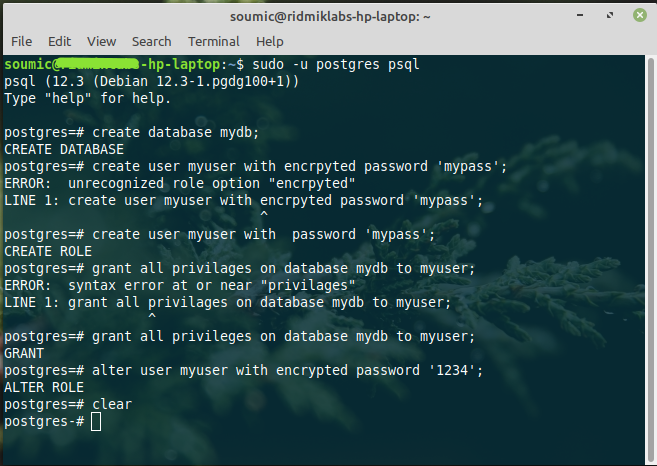

Image by <a href="https://pixabay.com/users/sasint-3639875/?utm_source=link-attribution&amp;utm_medium=referral&amp;utm_campaign=image&amp;utm_content=1822636">Sasin Tipchai</a> from <a href="https://pixabay.com/?utm_source=link-attribution&amp;utm_medium=referral&amp;utm_campaign=image&amp;utm_content=1822636">Pixabay</a>
# Installing Postgresql
The course will be using this database. Hence the first thing to do is install the database. I am 
currently using `Debian 10 Testing` (actually it's `Linux Mint Debian Edition` alias `LMDE4`, and I tweaked the software sources file by changing `stable` into `testing`, so it's really `Debian 10 Testing` with a different 'skin') as my main os. In production however, one should use a stable os.

*Correction* At the time of writing, the debian testing has some really buggie packages (usually that is not the case though) and so I had to switch back to stable.

Follow my instructions precisely:
1. Go to [postgresql download page](https://www.postgresql.org/download/) and select your distro (debian for my case). Then follow the instructions. You can add the repository, or directly download 
from debian's repository.
```
$ sudo apt-get install postgresql
```
***Warning***: If you add postgresql repository, you may encounter an error. To fix it, go to `/etc/apt/sources.list.d`, and then open the `pgdg.list` as root. Then you'll see: `deb http://apt.postgresql.org/pub/repos/apt <DISTRO>-pgdg main`. Change the distro to `buster` (it is the official name of debian 10).
So in my case, I saw `deb http://apt.postgresql.org/pub/repos/apt debbie-pgdg main` and so I changed it into `deb http://apt.postgresql.org/pub/repos/apt buster-pgdg main`.

## Initial Setup
Postgresql comes with a default user `postgres`. To use postgresql, we can switch to this user. Fire up your terminal and type:

```bash 
$ sudo -u postgres psql
```
Now you should be able to run sql commands as user `postgres`.

To create a new user:     ``` postgres=# create user myuser with  password 'mypass'; ```
To create a new database: ``` postgres=# create database mydb; ```
Now we want to assign `myuser` to `mydb`. The command: ``` postgres=# grant all privileges on database mydb to myuser; ```

* If you want to change password: ```bash postgres=# alter user myuser with encrypted password '1234'; ```



## Alternative Setup (Thanks to digital oceans)
The previous one was not good, and I was having some trouble getting started. So I found this awesome tutorial of [digital oceans](https://www.digitalocean.com/community/tutorials/how-to-install-and-use-postgresql-on-ubuntu-18-04). You'll find details in the link. Short version:
Switch over to the postgres account on your terminal by typing:
```
$ sudo -i -u postgres
```
You'll see the terminal like this: 
``` bash
postgres@computer-name:~$ 
```
We can use `psql` command to log in, and then \q to log out. Now we want to create a new database user. We need to create: 
1. user in postgres, 
2. user in our linux system
To create user in postgres, type:
```bash
postgres@computer-name:~$ createuser --interactive
# Output
Enter name of role to add: admindb
Shall the new role be a superuser? (y/n) y  # <-- I am creating this as a database superuser for now.                                              # in other cases, we may not need it
```

Now create a database with the same name. It is some postgresql convension.
```bash
postgres@computer-name:~$ createdb admindb
```

Now we have to create a Linux User with the same name:
```bash
postgres@computer-name:~$ exit      # quit the postgres user and return to your default user
$ sudo adduser --no-create-home admindb    #  --no-create-home flag prevents creating new home
```

Once this new account is available, you can switch over and connect to the database by typing:
```bash
$ sudo -i -u admindb
admindb@computer-name:~$ psql
admindb=#                           # you have logged into the database user admindb
```

I forgot to take a screenshot. So no image here.

# References
* [Add images to markdown file](https://medium.com/markdown-monster-blog/getting-images-into-markdown-documents-and-weblog-posts-with-markdown-monster-9ec6f353d8ec)
* [Add new user, new table etc](https://medium.com/coding-blocks/creating-user-database-and-adding-access-on-postgresql-8bfcd2f4a91e)
* [how-to-install-and-use-postgresql-on-ubuntu-18-04](https://www.digitalocean.com/community/tutorials/how-to-install-and-use-postgresql-on-ubuntu-18-04)