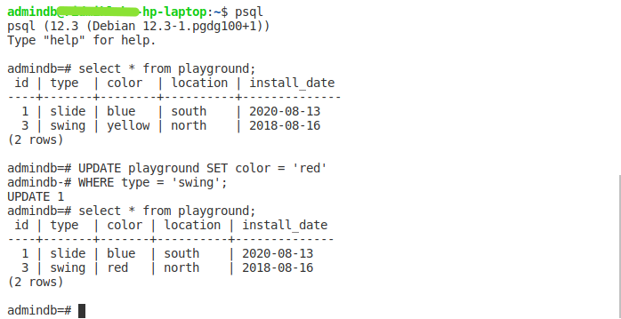

# Basic Commands
## Creating and Deleting Tables
Basic command:
```sql
CREATE TABLE table_name (
    column_name1 col_type (field_length) column_constraints,
    column_name2 col_type (field_length),
    column_name3 col_type (field_length)
);
```
So for example:
```sql
CREATE TABLE playground (
    id serial PRIMARY KEY,
    type varchar (50) NOT NULL,
    color varchar (25) NOT NULL,
    location varchar(25) check (location in ('north', 'south', 'east', 'west')),
    install_date date
);
```

We can see out table by typing:

```sql
admindb=# \d
```


##  Adding, Querying, and Deleting Data in a Table
* Adding
```sql
INSERT INTO playground (type, color, location, install_date) 
VALUES ('slide','blue', 'south','2020-08-13');

INSERT INTO playground (type, color, location, install_date) 
VALUES ('swing', 'yellow', 'north', '2018-08-16');
```
* Quering:
We can see these values such as:
```sql
SELECT * FROM PLAYGROUND;
SELECT * FROM PLAYGROUND WHERE ID = 1;
```
* Adding and Deleting Columns from a Table
```sql
ALTER TABLE playground ADD last_maint DATE;
```
sO NOW THE TABLE LOOKS LIKE THIS:
```sql
admindb=# SELECT * FROM PLAYGROUND;
 id | type  | color  | location | install_date | last_maint 
----+-------+--------+----------+--------------+------------
  1 | slide | blue   | south    | 2020-08-13   | 
  3 | swing | yellow | north    | 2018-08-16   | 
(2 rows)
```

```sql
ALTER TABLE PLAYGROUND DROP last_maint;
```

* Updating Data in a Table
```sql
UPDATE playground SET color = 'red' 
WHERE type = 'swing';
```



To view the table:
```sql
admindb=# \d playground

                                      Table "public.playground"
    Column    |         Type          | Collation | Nullable |                Default                 
--------------+-----------------------+-----------+----------+----------------------------------------
 id           | integer               |           | not null | nextval('playground_id_seq'::regclass)
 type         | character varying(50) |           | not null | 
 color        | character varying(25) |           | not null | 
 location     | character varying(25) |           |          | 
 install_date | date                  |           |          | 
Indexes:
    "playground_pkey" PRIMARY KEY, btree (id)
Check constraints:
    "playground_location_check" CHECK (location::text = ANY (ARRAY['north'::character varying, 'south'::character varying, 'east'::character varying, 'west'::character varying]::text[]))

```

# Reference

* [how-to-install-and-use-postgresql-on-ubuntu-18-04](https://www.digitalocean.com/community/tutorials/how-to-install-and-use-postgresql-on-ubuntu-18-04)