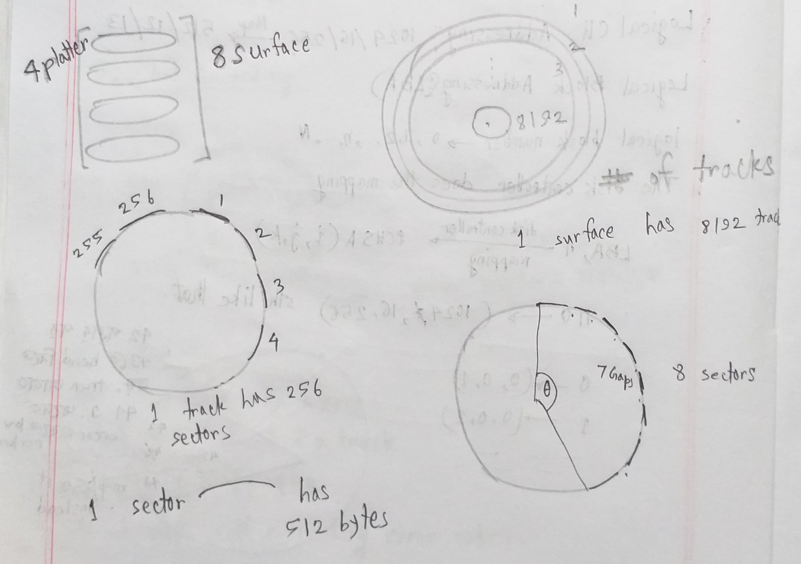
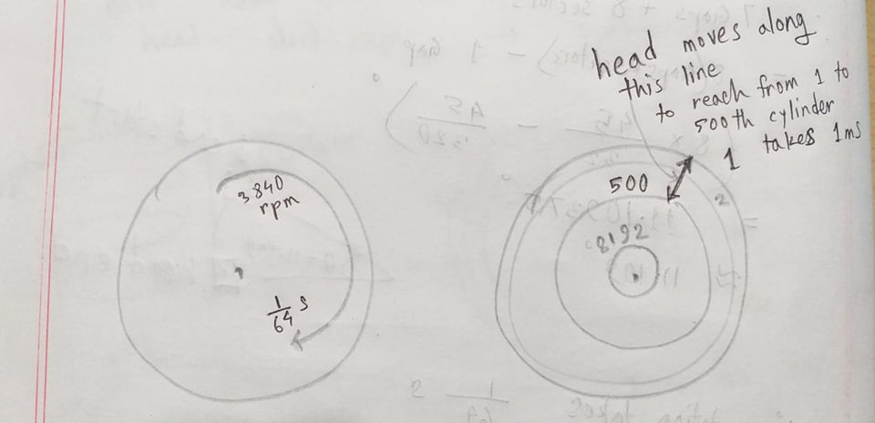

# Database Insert Time Explanation

Before we begin, let's start with 2 simple simple code snippets:
1. Bulk insert using a for loop:
```
for row in dataset_scv:
    insert_statement = "INSERT INTO some_table ("+ row +");";
    cursor.query(insert_statement);
    connection.commit();
```

2. Bulk insert using, say, COPY command:
```

insert_statement = "COPY some_table(
    CompanyName,EmailAddress,ContactFullName,ContactJobTitle,PhoneNumber,FaxNumber,
    Address,Address2,Address3,Town,County,Postcode,Region,Country, SICCode, 
    BusinessCategory,WebAddress) 
    FROM '/home/user/location/to/input.csv' 
    DELIMITER ',' csv header;"

cursor.query(insert_statement);
connection.commit();
```

Assume, an `input.csv` file has about `2 Million` rows with 17 columns , and the csv file size is about `500 MB`.
What would happen if you run these 2 codes?

The 1st one would work very slowly (something like 8 hours) but the 2nd one took about 50 seconds on my laptop! 
So the question is why did it happen?

To answer that, we need to understand the underlying hardware related stuff. Remember, this is a 
simplified version. Today while studying on the internet, I came accross some slides with some 
probability density functions and other complicated maths. We are not doing anything like those here, we are just interested in the 2 queries above.

1. Basically everything happens in the main memory. So for some task T, it will take take time 
```
       t = readTime(rt)+modificationTime(mt)+writeTime(wt)+verificationTIme(vt)
    => t = rt + mt + wt + vt
```
Now, hard disk read/write times are larger than in-memory operations (it takes about 10^5 ~ 10^6 in-memory operations while 1 disk I/O operation takes place). That is why, hard disks read / write in `BULK AMOUNT`.

So we'll take Megatron 747 as our example.
Given, each Megatron has 4 platters.
Each platter has 2 surfaces.
Each surface has 8192 tracks.
Each track has 256 sectors, and 256 gaps and gap : sector = 1 : 9.
Each sector has 512 byte.
The disk rotation speed is 3840 rpm <=> 1 rotation takes 1/64 s.
The head of disk can travel 500 cylinders in 1 ms.

How much time does it take to read/write 4 KB data?
## Simple Case Calculations: No rotation, No Head adjust, Only Read from Disk





todo: change the pictures later

As you can see, I have drawn the given informations in the picture. I hope they are helpful.
You may look this [awesome video](https://www.youtube.com/watch?v=Cj8-WNjaGuM) to have a better understanding.

In the 1st photo, I have drawn 4 images. Look at the 4th one (bottom right). Short version, there are 8192 circles. Each of them are divided into 256 parts (gaps + sectors).

Since 1 sector has 512 bytes, we need 4098 byte / (512 byte/sector) = 8 sectors.
So according to the figure, 8 sectors + 7 gaps create `theta` degree angle.

Thus to read 4 KB, we need to calculate the time it takes to travel `theta` degree.

1 gap + 1 sector creates `theta1 = 360 / 256 degree`.
Since 1 gap is `10 % of theta1`, 1 gap takes `theta2 = 10 % theta1`.

So 8 sectors + 7 gaps create `theta` is, 
```
theta   = 8x(angle by 1 gap + 1 sector) - 1 gap
        = 8 x theta1 - theta2
        = 8 x  360 / 256 - 36/256
        = 11.109 degree
```

Therefore, read/write time = transferTime = disk rotation time taken to rotate 11.109 degree
                           = (11.109 / 360) x (1/64) s
                           = 0.48 ms

When disk rotation / head adjust takes place, you have to add rotationTime and headAdjustTimes with this transferTime.
    ``` TotalTime = rotationTime + headAdjustTime + transferTime ```

I don't wish to give another example without drawing a corresponding picture first.

## Back to our question: What happened?
So our file size is 500 MB (2 Million data).
If we calculate just like previously, it should take `500 x 1024 KB / 4 kB x 0.48 ms = 61.44 s` for our Megatron 747. 
Practically, some more time will take as there are disk rotation, head adjust, OS context switching etc in play.

Remember, database read/write happens in bulk amount. So in the 2nd code, postgresql reads data from csv in bulk amount (idk, maybe `X` KB at a time). Then it is in main-memory for a short time doing some simple calculations (creating index, etc) FOR ALL THE DATA IN `X` KB. 
After that, a bulk write of `X` KB into the database takes place.

But when you write the 1st code, it takes more time cz, postgresql reads data from csv in bulk amount (idk, maybe `X` KB at a time). Then it is in main-memory for a short time doing some calculations (eg, creating index) FOR ONLY 1 ROW OUT OF `X` KB DATA. 
After that, a bulk write of `X` KB into the database takes place.
So for the 1st code, this database read / write varies as the number of rows (2 Million in this case).
So it should take 0.48 ms x 2x10^6 = 960000 s = 11.11 days(!) to insert all the data in Megatron 747 (apparently, that dude had a modern/faster hard disk, hence it took 8 hr).

