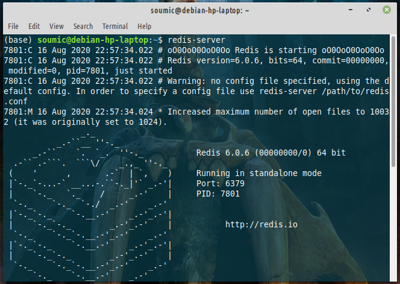
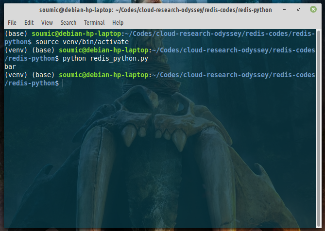

# Hello World Codes for Redit
Hello there, wonderful person! In this doc, we'll be creating some basic hello world codes in python
and in java (java cz it's a statically typed language and so I can understand precisely what data type I am working with. With python, that sometimes becomes awkward / ambiguous. But that's a subjective matter).

## Basic Code with Python
1. Setup python on your computer. I'm using debian, and for convenience, I prefer to install `Miniconda` which has some handy features and kind of makes python 3 'the default python'. We also need
`virtualenv`:
```
$ sudo apt install virtualenv
```
Virtualenv is handy to install python packages only for a particular project and resolve dependency errors , stuffs like that.

2. Now create a folder(say `redis-codes/redis-python/` in my repository) and create a new python file, say, `redis_python.py`

3. create a virtualenv, say, `venv`:
```
$ cd /redis-codes/redis-python
redis-codes/redis-python$ virtualenv venv
```
You sould see a new folder `venv` inside redis-python. Otherwise you are in a wrong place in the terminal.
Now:
```
redis-codes/redis-python$ source venv/bin/activate
(venv) redis-codes/redis-python$                     # <---- You should see (venv) at beginning
```
4. Now we need to install `redis-py` package inside this `venv`.
```
(venv) redis-codes/redis-python$ pip install redis
```

5. Now open `redis_python.py` and type in the codes:
```
import redis

''' 
warning: DONOT make any folder name  = `redis`, otherwise python will load `your redis folder` instead of the `actual redis folder`
'''
def hello_redis():
    r = redis.Redis(); 
    #  Redis(host = '127.0.0.1',post = '6379',password = ''); 
    # looks like this constructor is depricated
    
    r.set('foo', 'bar');

    key = 'foo'
    value_bytes = r.get(key);
    value_str = value_bytes.decode("utf-8");
    print(value_str);
    pass;

if __name__ == "__main__":
    hello_redis();
    pass;
```

6. Fire up a terminal and run:
```
$ redis-server
```
You should see something like this:


7. Now from a 2nd terminal, run `redis_python.py`
```
(venv) redis-codes/redis-python$ python redis_python.py
```
You should see output like this:


If you also see it, you have successfully run the redis hello world in python!

8. In the first terminal, press `ctrl + c` to shut down redis-server.

## Explanation of the code:
1st import redis. Then `r = redis.Redis()` creates the connection with the redis server that
you started in the 1st terminal. Redis can be used to demonstrate data-structures like Map.
So here `r.set("foo", "bar");` creates a map inside redis. You can create multiple key-value 
pairs like `r.set("foo1", "bar1"); r.set("foo2", "bar2");` etc. 

Now we can access these values using their corresponding keys:
`value_in_bytes = r.get(key)`
The results were in byte. `print(value_in_bytes)` gives `b'bar'`. 
So `value_string = .decode("utf-8");` gives us the desired value.

And that's pretty much it.