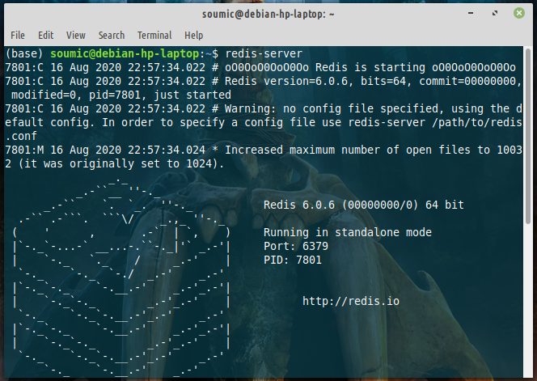
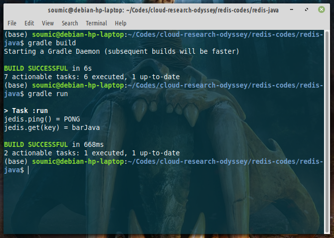

# Hello World Codes for Redis (Java)
Hello there, wonderful person! In this doc, we'll be creating some basic hello world codes in python
and in java (java cz it's a statically typed language and so I can understand precisely what data type I am working with. With python, that sometimes becomes awkward / ambiguous. But that's a subjective matter).

## Basic Code with Java
1. Install java and gradle. The easiest way to do so in linux is install [sdkman](https://sdkman.io/).

```bash
$ sdk install java 14.0.2.fx-librca    # <-- java 14, feel free to install some other java version
$ sdk install gradle 6.6.0
```
2. Create a `java` project with your favourite IDE or terminal. For easy dependency management, I'll be using `gradle`. Alternatively you can use jar files or maven. You can find the codes in 
`redis-codes/redis-java` folder in my repository.

3. Open `build.gradle.kts` or `build.gradle` file, and add the dependency:
```groovy
// jedis: java redis
    implementation("redis.clients:jedis:3.3.0");
```
4. Create a new java class (say `RedisController.java`) and add the following codes:
```java
import java.util.*;
import redis.clients.jedis.Jedis;

public class RedisController {
    
    public RedisController() {
        Jedis jedis = new Jedis("localhost");
        System.out.println("jedis.ping() = "+jedis.ping());
        
        String key = "fooJava";
        String value = "barJava";

        jedis.set(key, value);

        String output = jedis.get(key);

        System.out.println("jedis.get(key) = "+output);

    }
}
```

5. Now in the main method (found in `App.java` in my project), create a `RedisController` object.
```java
public static void main(String[] args) {
    RedisController redisController = new RedisController();
}
```
6. Fire up your terminal and start the redis server:
```bash
$ redis-server
```


7. Now build and run your java project:
```bash
$ cd redis-codes/redis-java
$ gradle build
$ gradle run
```
You should see an output like this:



And that's it!

8. Press `ctrl+c` to close redis-server.

## Explanation of the Code:

In `RedisController.java`, first import necessary libraries. Then in the constructor, we create a Jedis object `Jedis jedis = new Jedis("localhost");`. We can test out connection using `ping`:
```java
        System.out.println("jedis.ping() = "+jedis.ping()); // <-- output: pong
```

If our connection is ok, we can use object `jedis` to demonstrate different data structures. So in 
this case, we'll be using jedis just like a Map (HashMap or TreeMap):

```java
Map<String, String> mp = new TreeMap<>();
mp.put("someKey", "someValue");
String val = mp.get("someKey"); // <-- output = "someValue"
```

And in jedis:
```java
jedis.set("someKey", "someValue");
String output = jedis.get("someKey"); // <-- output = "someValue"
```

And this is how it works.

## Reference:
[redislabs/get-started-with-redis/](https://redislabs.com/get-started-with-redis/)
