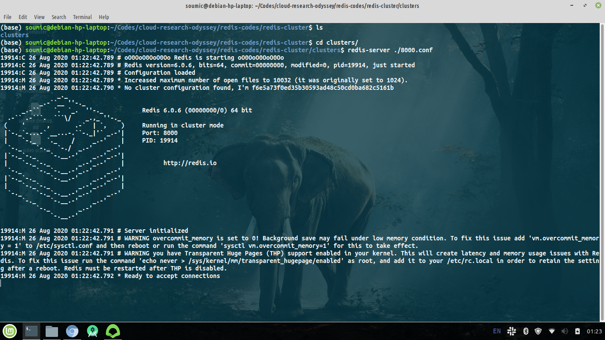
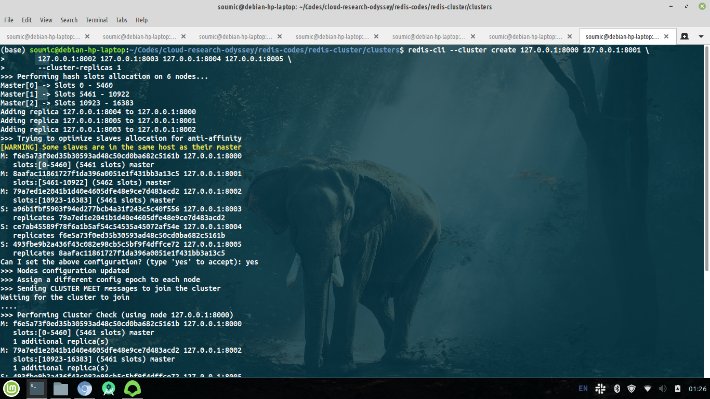
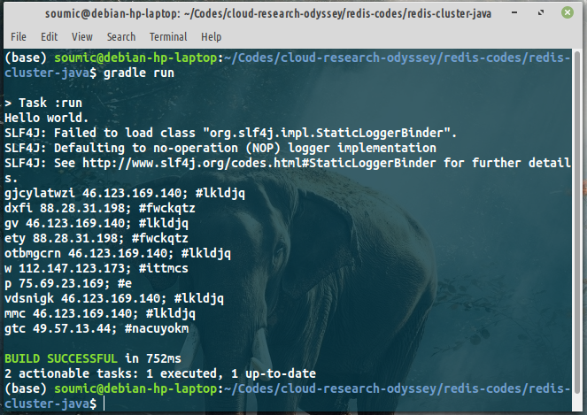

# Solve CodeForces 918B using Redis and Java
I think the easiest way to learn a language, library or framework is simply to
solve problems with it.So I came up with a funny idea! Let's use redis to solve
some programming problems. CodeForces 918B is an easy one.

Problem link: [918/problem/B](https://codeforces.com/contest/918/problem/B)

Short version, we are given some pairs of (`servername` , `ipAddress`).
Then we are given some pair of (`command` , `ipAddress`). We have to create output 
of tuples showing (`command`, `ipAddress`, `servername`).

## Soln idea:
Create a `Map<String, String> mp;`, then create `mp.set(ip, servername)`.
Finally, output is `command, ip, mp.get(ip);`.

## Create Redis Cluster
Create a folder named `clusters`. Create 6 files named `800x.conf`. (x = 0,1,2,3,4,5).
Edit the contents in `800x.conf` like this:

```yml
port 800x
cluster-enabled yes
cluster-config-file cluster-node-0.conf
cluster-node-timeout 5000
appendonly yes
appendfilename node-0.aof
dbfilename dump-0.rdb
```

Now open 6 terminals. In each of them, invode the command:
```bash
redis-server /path/to/clusters/800x.conf
```



Now open 7th terminal and run:
```bash
redis-cli --cluster create 127.0.0.1:8000 127.0.0.1:8001 \
        127.0.0.1:8002 127.0.0.1:8003 127.0.0.1:8004 127.0.0.1:8005 \
        --cluster-replicas 1
```


You should see something like this:

Once done, create a java project with `jedis` dependency. I'll be using gradle for dependency management.
Create a file (say, `B918.java`).

To connect with the redis cluster, use this code:
```java
String host = "127.0.0.1";
int portNumberOfAMaster = 8000;
JedisCluster jedisClusterMap = new JedisCluster(new HostAndPort(host, portNumberOfAMaster));
```
Here we only have to provide one master's port. Jedis will autodetect the rest of the masters and slaves.

Now that we have a connected java with redis, we can read input (say, from a file) and insert them in map:

```java

            for(int i=0; i<n; i++) {
                serverName = sc.next().trim(); // trim removes \n, \t, etc string literals
                serverIp = sc.next().trim();
                serverIp = serverIp + ";";
             
                jedisClusterMap.set(serverIp, serverName);  // <-----
            }
```

And finally, on each query, we create the output tuples like this way:
```java
   for(int i=0; i<m; i++) {
                command = sc.next().trim();
                ip = sc.next().trim();
//                System.err.println(ip);
                serverName = jedisClusterMap.get(ip);   // <------------ 
                System.out.println(command+" "+ip+" #"+serverName);
            }
```

## Input:
You can find it in `redis-codes/redis-cluster-java/src/main/java/redis/cluster/java/jedisforces/input.txt` file.
## Output:


That's how it works.

# References:
1. [baeldung.com/jedis-java-redis-client-library](https://www.baeldung.com/jedis-java-redis-client-library)
2. [918/problem/B](https://codeforces.com/contest/918/problem/B)