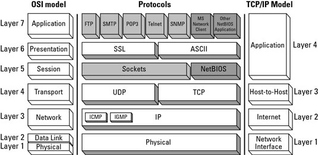
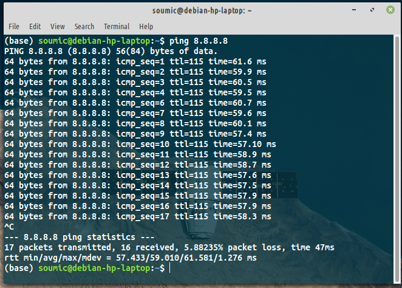

# Networking Basics
## 1. OSI Model
OSI stands for `Open System Interconection`. It was developed by ISO (`International Organization of Standards`) in 1984. It has 7 layers:
APSTDNP --> 
1. Application layer (HTTP, FTP, DNS, SNMP, Telnet)
2. Presentation lauer (SSL, TLS)
3. Session layer (NetBIOS, PPTP)
4. Transport layer (TCP, UDP)
5. Network layer (IP, ARP, ICMP, IPSec) <-- Layer3
6. Data Link layer (PPP, ATM, Ethernet) <-- Layer2
7. Physical layer (Ethernet, USB, Bluetooth, IEEE802.11)


Image credit: [GeeksForGeeks (18/09/2020)](https://media.geeksforgeeks.org/wp-content/uploads/computer-network-osi-model-layers.png)

## TCP/IP Model
The OSI Model we just looked at is just a reference/logical model. It was designed to describe the functions of the communication system by dividing the communication procedure into smaller and simpler components. But when we talk about the TCP/IP model, it was designed and developed by Department of Defense (DoD) in 1960s and is based on standard protocols. It stands for Transmission Control Protocol/Internet Protocol. The TCP/IP model is a concise version of the OSI model. It contains four layers, unlike seven layers in the OSI model. The layers are:

1. Process/Application Layer
2. Host-to-Host/Transport Layer
3. Internet Layer
4. Network Access/Link Layer

The diagrammatic comparison of the TCP/IP and OSI model is as follows :


(image source: google)

# $ ping 8.8.8.8
`Ping` is a computer network administration software utility used to test the reachability of a host on an Internet Protocol network. It is available for virtually all operating systems that have networking capability, including most embedded network administration software.

What is 8.8.8.8?

8.8. 8.8 is the primary DNS server for Google DNS. Google DNS is a public DNS service that is provided by Google with the aim to make the Internet and the DNS system faster, safer, secure, and more reliable for all Internet users.

If we open our terminal and invoke the command `ping 8.8.8.8`, the output is:



So as you can see, we can measure latency / time using ping.
```
                   t1 ms
          --------------------> 
     me                           Server
         <---------------------                      
                   t2 ms

              latency = (t1 + t2) ms
```

# Hop

```
              hop             hop
      p1  -----------> p2 ----------> p3
```
P1-p2 -> 1 hop, p1-p3 -> 2 hop.

In wired computer networking, including the Internet, a hop occurs when a packet is passed from one network segment to the next. Data packets pass through routers as they travel between source and destination. The hop count refers to the number of intermediate devices through which data must pass between source and destination.

Since store and forward and other latencies are incurred through each hop, a large number of hops between source and destination implies lower real-time performance.


### Hop Count: 
In wired networks, the hop count refers to the number of intermediate network devices through which data must pass between source and destination. Hop count is a rough measure of distance between two hosts. A hop count of n means that n network devices separate the source host from the destination host.

### Hop Limit: 
Known as time to live (TTL) in IPv4, and hop limit in IPv6, this field specifies a limit on the number of hops a packet is allowed before being discarded. Routers modify IP packets as they are forwarded, decrementing the respective TTL or hop limit fields. Routers do not forward packets with a resultant field of 0 or less. This prevents packets from following a loop forever.

### Next Hop:
When configuring network devices the hop may refer to next hop. Next hop is the next gateway to which packets should be forwarded along the path to their final destination. A routing table usually contains the IP address of a destination network and the IP address of the next gateway along the path to the final network destination. By only storing next-hop information, next-hop routing or next-hop forwarding reduces the size of routing tables. A given gateway only knows one step along the path, not the complete path to a destination. It is also key to know that the next hops listed in a routing table are on networks to which the gateway is directly connected .